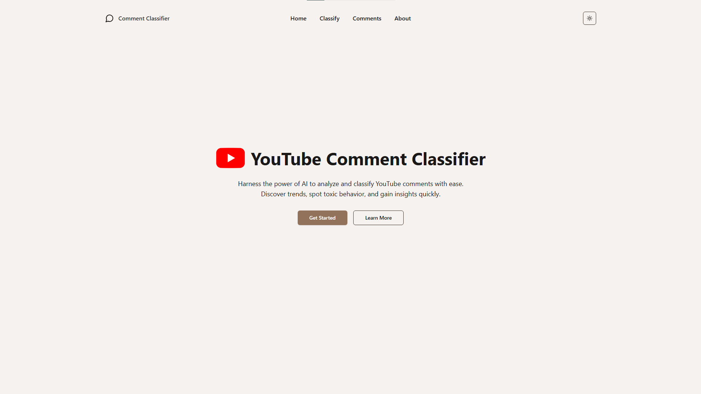
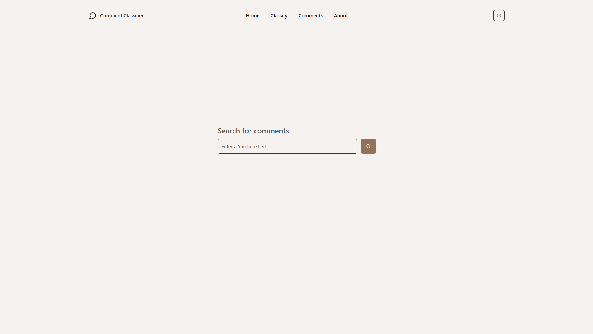
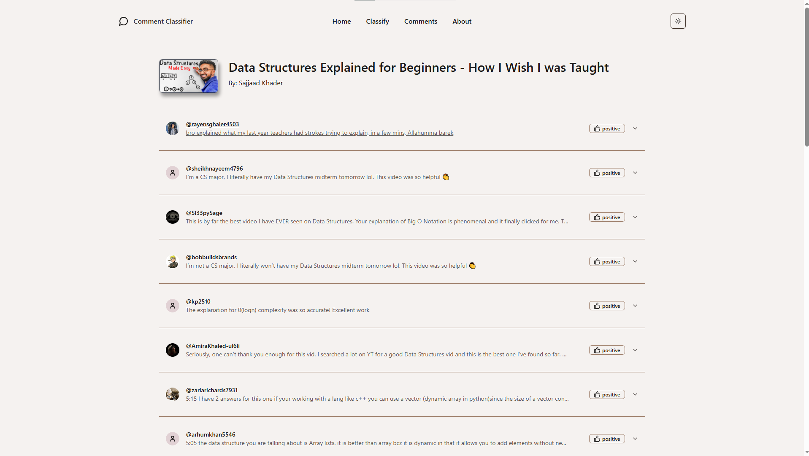

<div align="center">
  <h2 align="center">Youtube Comment Classifier</h2>
  <a href="(https://github.com/emailherds/Youtube-Comment-Classifier-App)">
    
  </a>
    <br />
      <br />
<p>A full-stack application that analyzes YouTube comments using machine learning to classify sentiment and provide insights for content creators.</p>
</div>

## Table of Contents

- [Features](#features)
- [Tech Stack](#tech-stack)
- [How it works](#how-it-works)
- [Screenshots](#screenshots)
- [Installation and Setup](#Installation and Setup)

## Features

- **Comment Analysis**: Automatically fetch and analyze comments from any YouTube video
- **Sentiment Classification**: Categorizes comments using an LSTM neural network model
- **Interactive UI**: View comments organized by sentiment with expandable details
- **Probability Visualization**: See the confidence levels of each classification
- **User-Friendly Interface**: Clean, responsive design built with React and Shadcn UI

## Tech Stack

### Frontend
- React + TypeScript
- Tailwind CSS
- Shadcn UI Components
- Lucide Icons
- Vite

### Backend
- Python
- Flask
- YouTube Data API
- TensorFlow/Keras (LSTM model, found in my github!)

## How It Works

1. **Input**: User provides a YouTube video URL
2. **Data Collection**: Backend fetches video metadata and comments via YouTube API
3. **Processing**: Comments are analyzed by the LSTM model for sentiment classification
4. **Visualization**: Results are displayed in an intuitive interface showing sentiment probabilities

## Screenshots
<div>
      
    
    
    

</div>

## 🔧 Installation and Setup

### Prerequisites
- Node.js (v14+)
- Python (v3.8+)
- YouTube API key

### Frontend Setup
```bash
# Navigate to frontend directory
cd frontend

# Install dependencies
npm install

# Start development server
npm run dev
```

### Backend Setup

```bash
# Navigate to backend directory
cd backend

# Create and activate virtual environment
python -m venv venv
source venv/bin/activate  # On Windows: venv\Scripts\activate

# Install dependencies
pip install -r requirements.txt

# Set up environment variables
# Create a .env file with your YouTube API key
echo "YOUTUBE_API_KEY=your_api_key_here" > .env

# Start the server
python app.py
```
